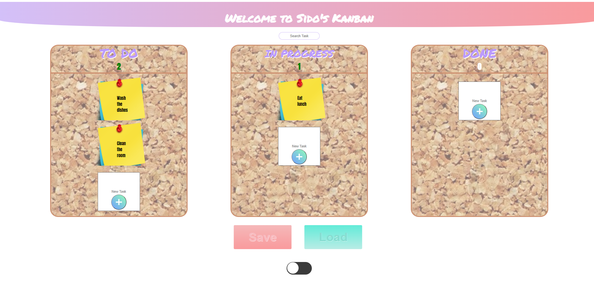

# Cyber4s 3rd Pre-Course Final Project

## Welcome to Sido's Kanban



## Table of contents
* [General info](#general-info)
* [Setup](#setup)
* [Instructions](#instructions)
* [API Integration](#api-Integration)
* [Contributing](#contributing)
* [Contact](#contact)

## General info

This project helps you to track your daily tasks easliy

## Setup

To run this project execute
```
  npm run final <your name> 

```
 (replace `<your name>` with your name). This command will install all the needed dependencies, and generate an [api-data.txt](#api-integration) file.

## Instructions

1. Click on one of the add-task buttons, to add a new task to the respective list. The task content will be taken from the respective input field. (must contain to add)
2. Double clicking a task will enable to edit its text. The change will be saved after loosing focus.
3. Hovering over a task element and pressing `alt + 1-3` will move the task to the appropriate list (`1`: todo, `2`: in-progress, `3`: done).
4. The search input filters tasks case-**in**sensitively, so that only tasks that match the search string are displayed.
5. Right click on task will delete it.
6. Every time you add/remove task, will update the counter under the list's title (todo, in-progress, done).
7. Dragging task to other list will add it to the top of the appropriate list, Dragging task to other task will add it underneath it.
8. Click on the Load button will load the saved data from the API, Click on the save button will save the current data to the API.
9. Click on the switch at the bottom of the page will enable `Dark Mode`.
10. Exiting the page won't lose your date, everything is saved on `local storage`

## API Integration

Once you complete the [initial setup](#setup) you will see an `api-data.txt` file that was created in the project folder. This file will contain the URLs which you can access the API with, using a unique bin ID that was generated for you.

The API is a simple remote storage that gives you a "bin" where you can store data. It allows you to save a chunk of data, or load it.

## Contributing

Contributions are what make the open source community such an amazing place to learn, inspire, and create. Any contributions you make are greatly appreciated.

1. Fork the Project
2. Create your Feature Branch
3. Commit your Changes
4. Push to the Branch
5. Open a Pull Request

## Contact

Github: [@Yan Sidorenko](https://github.com/YanSido)

Project Link: [Sido's Kanban](https://github.com/YanSido/kanban-final)
